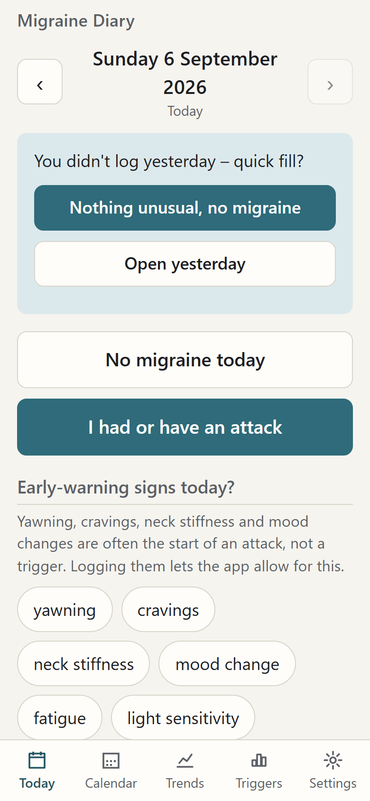
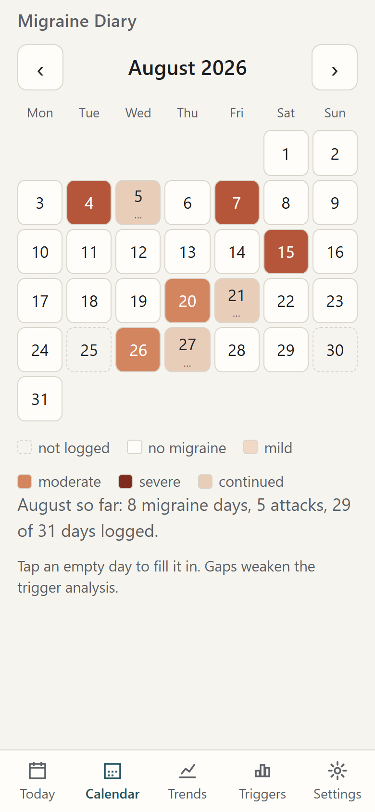
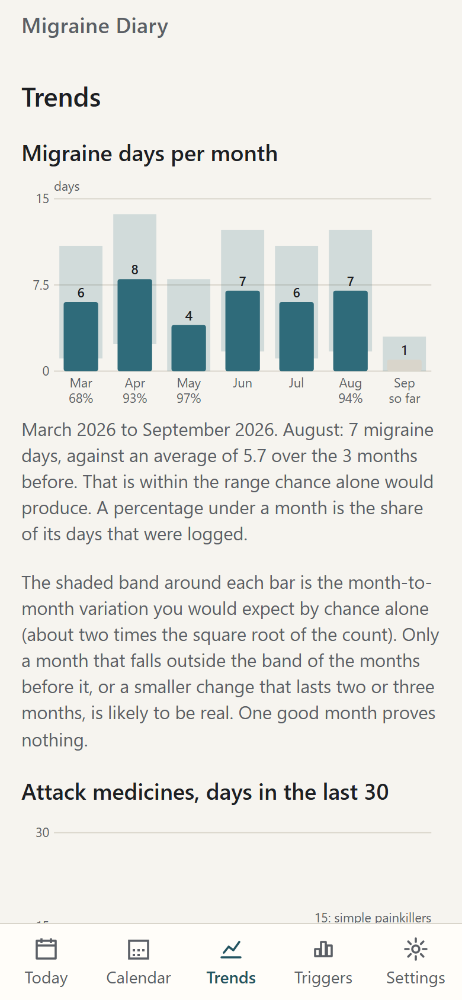
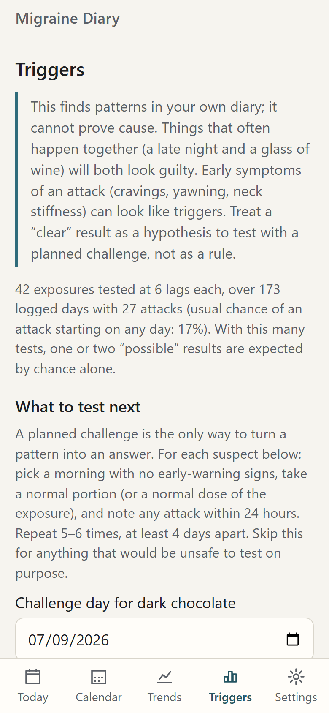
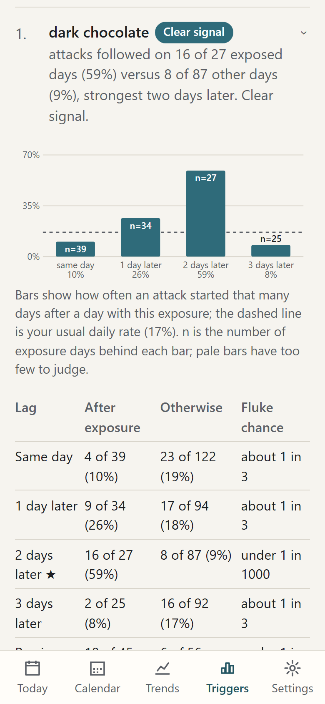
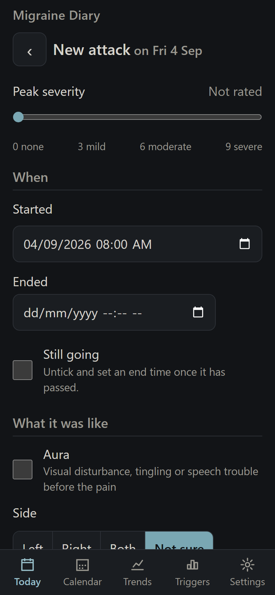

# Migraine Diary

A private, offline daily journal for people with migraine. Tick a few boxes once a day; over weeks the app shows, in plain English, which logged exposures were followed by attacks more often than chance, **including exposures one, two or three days before the attack**.

- Everything stays on your phone. No account, no server, no analytics, and no network requests after the first load except the weather fetch you trigger yourself.
- Installs to the Home Screen as a web app (iPhone Safari, Android Chrome) and also works on a desktop browser.
- A normal day takes under a minute to log; an attack takes a few taps.
- Export and import from day one, with reminders to back up.

## Try it in two minutes

1. Open the app (see *Running it* below).
2. Go to **Settings → Demo data → Load demo data**. Six months of made-up entries are written into the empty diary.
3. Open **Triggers**. The planted trigger, *dark chocolate*, ranks first with a clear signal "strongest two days later". The decoy, *aged cheese*, reads "no signal".
4. Open **Trends** for the monthly chart, the medication-overuse line and the attack profile.
5. **Settings → Delete everything** clears the demo before you start logging for real.

## Screenshots

| Today | Calendar | Trends |
|---|---|---|
|  |  |  |

| Triggers | Trigger detail | Attack sheet (dark theme) |
|---|---|---|
|  |  |  |

## Running it

The app is a static folder. Any web server will do; service workers need `http://localhost` or `https://`, so opening `index.html` straight from the file system will run the app but will not install it.

Locally:

```bash
python -m http.server 8000
```

then open <http://localhost:8000>.

### Hosting on GitHub Pages (free)

The source lives at <https://github.com/the1badger/MigraineDiary>.

1. Push `main` to that repository (`git push -u origin main`).
2. In the repository's **Settings → Pages**, choose *Deploy from a branch*, branch `main`, folder `/ (root)`.
3. After a minute the app is at <https://the1badger.github.io/MigraineDiary/>. Every later push to `main` redeploys it; installed copies show "Update available – reload" once `VERSION` in `sw.js` has been bumped.

Your diary never goes to GitHub or anywhere else: the host only serves the app's files. The data lives in the browser's own database on each device.

### Installing on an iPhone

1. Open the app's address in **Safari** (not Chrome; on iOS only Safari can install web apps).
2. Tap the **Share** button (the square with an arrow) at the bottom of the screen.
3. Scroll down and tap **Add to Home Screen**, then **Add**.
4. Open the app from the new icon from now on.

This matters on iOS: Safari can delete a website's stored data after 7 days without use unless the site is installed to the Home Screen. The app shows these steps once and nags for a backup after 14 days.

### Installing on Android

1. Open the app's address in **Chrome**.
2. Tap the **⋮** menu, then **Add to Home screen** (or **Install app**), then **Install**.

### On a desktop

Chrome and Edge show an install icon in the address bar. Firefox and Safari run it as a normal tab.

## Weather and air

The **Fetch today's weather** button on the Today screen (also available when back-filling any of the last 90 days) asks [Open-Meteo](https://open-meteo.com), a free service with no account or key, for the day's air pressure (min, max and change since the day before), humidity, sunshine hours, temperature, rain, PM2.5 and pollen. The request carries only your location rounded to about 1 km and the date. Each figure becomes a yes/no trigger at an editable cut-off (Settings → What counts as "yes"), so "pressure fell 5 hPa or more since yesterday" is analysed at the same lags as any tick box. Pollen is only available in Europe; elsewhere the card says so. Nothing is fetched unless you tap the button, and the app works offline as before.

## Backups

Your diary exists only on the device you log on. **Settings → Backup and export**:

- **Export backup (JSON)** saves everything, including settings, in a file you can import again on any device. On a phone the share sheet lets you send it straight to Files, Drive or an email to yourself.
- **Export spreadsheet (CSV)** is one row per day for Excel or Numbers. It is for analysis elsewhere, not for restoring.
- **Import backup** merges by date; for any day present in both places the copy edited most recently wins. You see the counts before anything changes.

Export a backup every couple of weeks. The app reminds you when the last one is more than 14 days old.

## How the analysis works

The Help screen inside the app explains it in full. In short:

- Each exposure (built-in questions after their cut-offs, your own tick boxes, and two composites: "ate out, any" and "exercise, any type") is tested at four lags (same day, 1, 2 and 3 days later) and over the previous 48 and 72 hours, using a two-sided Fisher exact test on the 2×2 table of exposed/unexposed days versus attack/no attack.
- Verdicts: p < 0.01 is "clear", 0.01–0.10 "possible", otherwise "no signal". With six tests per exposure, one or two "possible" results are expected by chance alone, and the screen says so.
- Gates: at least 28 logged days, 5 attacks, and 5 days with and 5 without the exposure; otherwise the screen says how many more are needed.
- Confounds handled: same-day findings that coincide with early-warning signs are flagged as likely symptoms and ranked lower; attack days are excluded from the exposure counts for lags 1–3; onsets within 48 hours of the previous one count as the same episode; co-occurring exposures are listed for any clear finding; hormonal phase is reported separately when logged.
- Trends: monthly migraine days with the ±2√M noise band; rolling 30-day acute-medication days against the 10-day (triptans, combination painkillers) and 15-day (simple painkillers) overuse lines; attack profile; logging completeness.
- Challenge tests: for the top suspects the app offers the provocation protocol (a clean morning, a normal portion, note attacks within 24 h, repeat 5–6 times at least 4 days apart) and compares attack rates after challenge days with the baseline.

Built-in tick boxes include exercise type (light or moderate, sport, resistance, HIIT), eating out (Thai, Vietnamese, Indian, pizza, other) with possible gluten contamination, supplements (magnesium, multivitamin, omega 3), and bright or fluorescent lighting. Supplements are analysed like any other exposure, so a protective effect shows up as "fewer attacks". Unticked tick boxes on a logged day count as "no"; numbers left blank are treated as unanswered and excluded, never as zero. Unlogged days are excluded.

## Development

No build step. Vanilla ES modules, hand-rolled SVG charts, a 100-line IndexedDB helper. There are no third-party libraries, so the `vendor/` folder is empty.

```
index.html              app shell and tab bar
manifest.webmanifest    PWA manifest
sw.js                   service worker: precache the shell, cache-first
css/styles.css          light theme on :root, low-glare dark theme on [data-theme=dark]
js/app.js               router, theme clock, save indicator, update prompt
js/state.js             in-memory diary + debounced write-through to IndexedDB
js/store.js             IndexedDB helper (stores: days, settings)
js/fields.js            built-in field definitions shared by form, engine and export
js/dates.js             local-date helpers
js/ui.js                DOM builder, dialogs, form controls
js/analysis.js          the pure analysis engine (no DOM)
js/charts.js            SVG chart helpers
js/export.js            JSON/CSV export, import with merge
js/demo.js              seeded synthetic diary generator (also used by tests)
js/banners.js           update / Add-to-Home-Screen / backup banners
js/reminders.js         best-effort daily notification
js/weather.js           Open-Meteo fetch and normalisation (the only network call)
js/views/*.js           one file per screen
tests/*.test.js         node --test
icons/                  app icons (regenerate with python icons/make_icons.py)
```

Opening the app with `?demo=1` in the address (for example `http://localhost:8000/?demo=1#/triggers`) loads the demo diary, but only into an empty database.

Run the tests (Node 18 or later):

```bash
node --test tests/
```

### Releasing an update

Bump `VERSION` in `sw.js` whenever any file in its `SHELL` list changes. The new worker installs the fresh cache in the background; users see "Update available – reload" and the old cache is deleted once they agree. Without the bump, installed copies keep serving the old files.

### Data model

One record per calendar date in the `days` store, keyed by `YYYY-MM-DD` in the user's local time zone:

```jsonc
{
  "date": "2026-09-04",
  "updatedAt": "2026-09-04T21:14:00+10:00",
  "attacks": [ { "id", "start", "end", "ongoing", "peakSeverity", "aura", "side", "nausea",
                 "lightSensitivity", "soundSensitivity", "neckPain", "acuteMeds": [{ "name", "doses" }],
                 "workedWithin2h", "lostDay" } ],
  "ongoingAttack": false,            // an earlier attack continued into this day
  "prodrome": ["yawning", "cravings"],
  "exposures": { "sleepHours": 6.5, "caffeineServings": 3, "neckLoad": true, "custom": { "dark chocolate": true } },
  "preventiveTaken": true,
  "acuteMedsOtherHeadache": false,
  "note": ""
}
```

The single `settings` record holds custom tick boxes, hidden built-ins, cut-offs, medicine names and classes, theme, reminder, last backup time and planned challenges.

## Not in this version

See [FUTURE.md](FUTURE.md).

## Licence

MIT.
